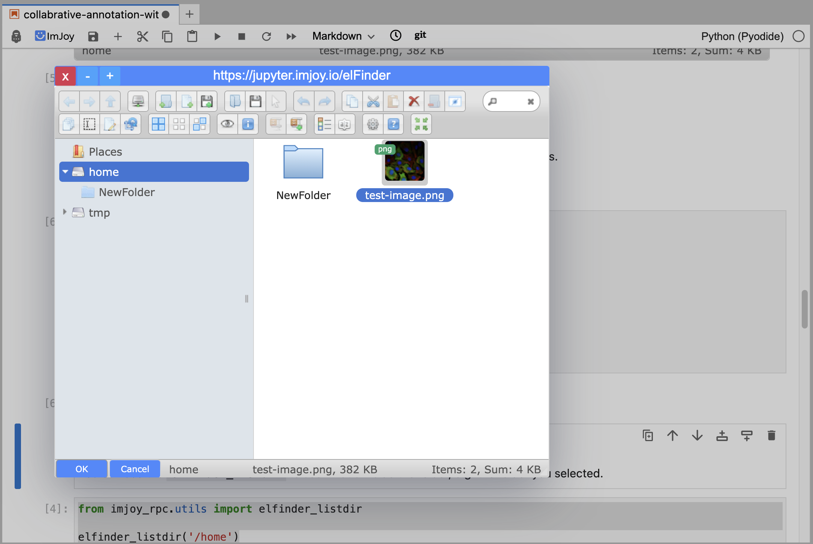

elFinder for ImJoy
========

elFinder is an open-source file manager for web, written in JavaScript using jQuery UI. See the original project [here](https://github.com/Studio-42/elFinder).

In this project, we use elFinder as a file manager for [ImJoy](https://imjoy.io) and integrated with [BrowserFS](https://github.com/jvilk/BrowserFS). By using a service worker, we can mount browserfs running inside a service worker, connect to IndexedDB, S3 backend, and provide an ImJoy interface to interact it inside a Jupyter notebook or other ImJoy supported websites.

**To try the elFinder, visit https://fm.imjoy.io/**


## Usage for ImJoy

You can go to https://jupyter.imjoy.io/, start a notebook and run the following code to open the file manager:

Show the file manager as an ImJoy plugin:
```python
from imjoy_rpc import api
async def setup():  
    fm = await api.createWindow(
        src="https://jupyter.imjoy.io/elFinder"
    )

api.export({"setup": setup})
```

With the following window open, you can drag and drop files to the file manager to upload them to the browser, download or preview files.



```python
from imjoy_rpc import api

async def setup():  
    fm = await api.showDialog(
        src="https://jupyter.imjoy.io/elFinder"
    )
    selections = await fm.getSelections()
    await api.alert(str(selections))
    

api.export({"setup": setup})
```


### Access elFinder files from Python

With the help of some utility functions in Python, you can also operate the files in the file manager:

```python
import io
from imjoy_rpc.utils import open_elfinder, elfinder_listdir

# import requests
# # Download a test image
# response = requests.get("https://images.proteinatlas.org/61448/1319_C10_2_blue_red_green.jpg")
# data = response.content


# Write the file to elfinder storage
with open_elfinder("/home/test-image.png", "wb") as f:
    f.write(data)

files = elfinder_listdir('/home')

print(files)
```

### Using elFinder with remote files on S3

You can use it to operate remote files on S3, by mount the S3 bucket to the browserfs. See the example below:

```python
from imjoy_rpc import api

access_key_id = ''
secret_access_key = ''
endpoint_url = ''
bucket = ''
prefix = ''

async def setup():  
    fm = await api.showDialog(
        src="https://jupyter.imjoy.io/elFinder"
    )
    # S3 URI format: s3://accessKeyID:secretAccessKey@endpointURL/bucket/prefix
    await fm.mount(f"s3://{access_key_id}:{secret_access_key}@{endpoint_url}/{bucket}/{prefix}")
  
api.export({"setup": setup})
```

As a more complete example, you can use it manage files in the [Hypha App Engine](https://ha.amun.ai/).
```python
from imjoy_rpc import api
from imjoy_rpc.hypha import login, connect_to_server

SERVER_URL = "https://ai.imjoy.io"

# To login, you need to click the url printed and login with your account
token = await login({"server_url": SERVER_URL})

# Connect to the BioEngine server
server = await connect_to_server(
    {"name": "test client", "server_url": SERVER_URL, "token": token}
)

s3 = await server.get_service("s3-storage")
s3_credentials = await s3.generate_credential()

# Now mount it into the elFinder
async def setup():  
    fm = await api.createWindow(
        src="https://jupyter.imjoy.io/elFinder"
    )
    await fm.mount(f"s3://{s3_credentials['access_key_id']}:{s3_credentials['secret_access_key']}@{s3_credentials['endpoint_url']}/{s3_credentials['bucket']}/{s3_credentials['prefix']}")

api.export({"setup": setup})
```


License
-------

elFinder is issued under a 3-clauses BSD license.

 * [License terms](https://github.com/Studio-42/elFinder/blob/master/LICENSE.md)
